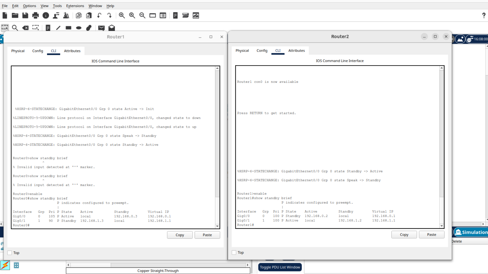
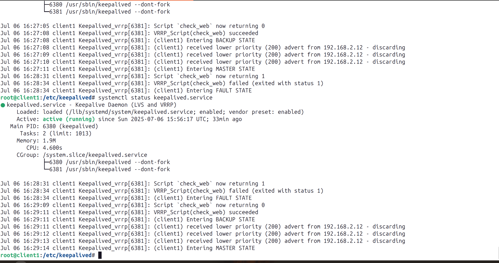
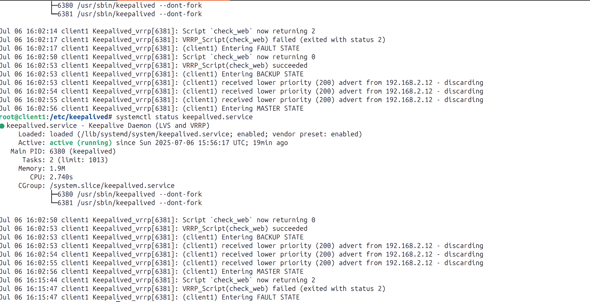

# Домашнее задание к занятию  «Disaster recovery и Keepalived» — Колыванов Антон

---

## Задание 1

Дана схема для **Cisco Packet Tracer**, рассматриваемая в лекции.  
На данной схеме уже настроено отслеживание интерфейсов маршрутизаторов `Gi0/1` (для нулевой группы).  
Необходимо аналогично настроить отслеживание состояния интерфейсов `Gi0/0` (для первой группы).  

Для проверки корректности настройки:
- разорвите один из кабелей между одним из маршрутизаторов и `Switch0`;
- запустите `ping` между `PC0` и `Server0`.

На проверку отправьте:
- получившуюся схему в формате `.pkt`;
- скриншот, где виден процесс настройки маршрутизатора.

📁 [Схема для Cisco Packet Tracer](1/zadanie1.pkt)

📷 Скриншот `show standby brief`:  

---

## Задание 2

- Запустите две виртуальные машины **Linux**;
- Установите и настройте сервис **Keepalived** как в лекции, используя пример конфигурационного файла;
- Настройте любой веб-сервер (например, `nginx` или `simple python server`);
- Напишите **Bash-скрипт**, который:
  - проверяет доступность порта веб-сервера;
  - проверяет существование файла `index.html` в root-директории веб-сервера;
- Настройте Keepalived так, чтобы он:
  - запускал скрипт каждые 3 секунды;
  - переносил виртуальный IP на другой сервер, если скрипт завершается с кодом, отличным от 0 (порт недоступен или отсутствует `index.html`);
- Используйте для этого секцию `vrrp_script`.

На проверку отправьте:
- получившийся `bash`-скрипт;
- конфигурационный файл `keepalived`;
- скриншот с демонстрацией переезда IP при ошибке.

📷 Проверка доступности порта 80 `exit 1`:  

📷 Проверка наличия `index.html` `exit 2`:  

📄 [Получившийся bash-скрипт](1/check_web.sh)  
📄 [Конфигурационный файл Keepalived](1/keepalived.conf)

---

## Задание 3*

- Изучите дополнительно возможность **Keepalived**, которая называется `vrrp_track_file`;
- Напишите **bash-скрипт**, который:
  - меняет приоритет внутри файла в зависимости от нагрузки на виртуальную машину;
  - (можно разместить в `cron` и запускать каждую минуту);
  - рассчитывает приоритет, например, по `Load average`;
- Настройте **Keepalived** на отслеживание данного файла;
- Нагрузите одну из ВМ, которая в состоянии `MASTER`, и проверьте:
  - чтобы через некоторое время она перешла в `SLAVE`;
  - чтобы IP переехал на менее загруженный сервер;
- Попробуйте настроить **Keepalived** на третьем сервере;
- При необходимости — скорректируйте формулу так, чтобы IP всегда был на наименее нагруженном сервере.

На проверку отправьте:
- получившийся `bash`-скрипт;
- конфигурационный файл `keepalived`;
- скриншоты логов keepalived с серверов при разных нагрузках.

📄 [Получившийся bash-скрипт](1/calc_priority.sh)  
📄 [Конфигурационный файл Keepalived](1/keepalived_zadanie3.conf)
